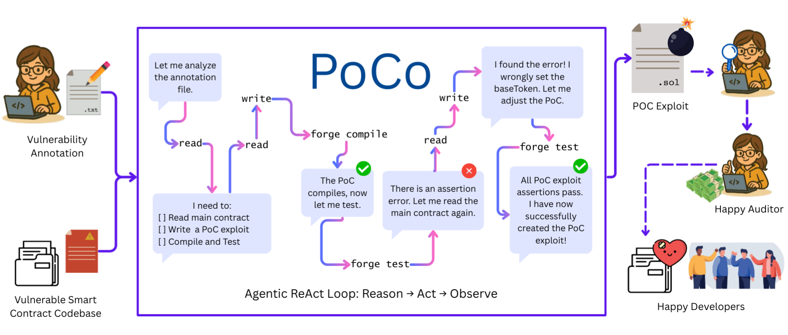

# PoCo: Agentic PoC Exploit Generation for Smart Contracts

<div align="center">


### 📄 [PoCo Paper](https://arxiv.org/abs/2511.02780) • 🗂️ [Proof-of-Patch Dataset](https://github.com/ASSERT-KTH/Proof-of-Patch)

<p align="center">
  
</p>

</div>


### 🔎 Repository Contents

This repository contains the experimental artifacts for PoCo:

- Agent execution trajectories  
- Evaluation results  
- Configuration files  


### 🔐 Access

Access to the full PoCo implementation is available upon request:

- vivia [at] kth.se  
- sofbob [at] kth.se  

---

### 📚 Citation

If you use PoCo or the Proof-of-Patch dataset in your work, please cite:

```bibtex
@article{anderssonbobadilla2025poco,
  title={PoCo: Agentic Proof-of-Concept Exploit Generation for Smart Contracts},
  author={Andersson, Vivi and Bobadilla, Sofia and Hobbelhagen, Harald and Monperrus, Martin},
  journal={arXiv preprint arXiv:2511.02780},
  year={2025}
}
```
